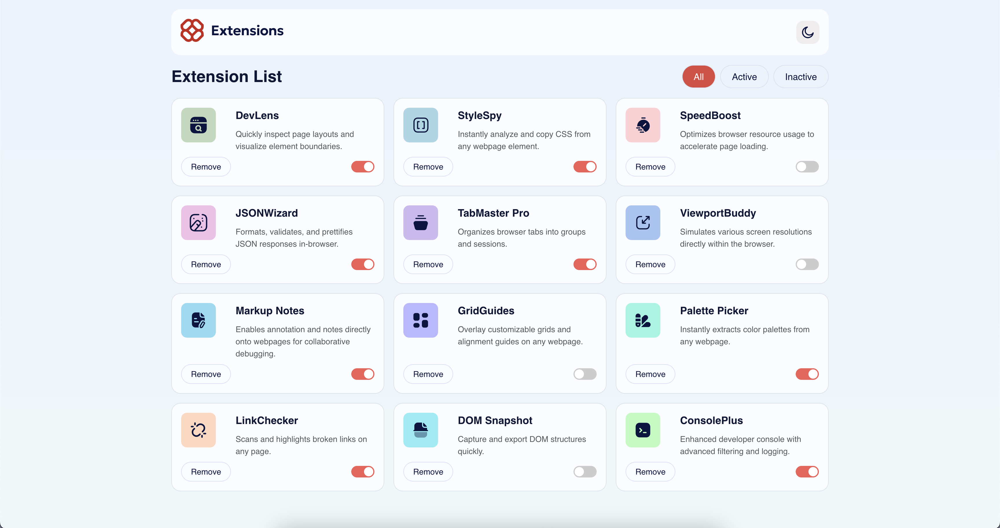
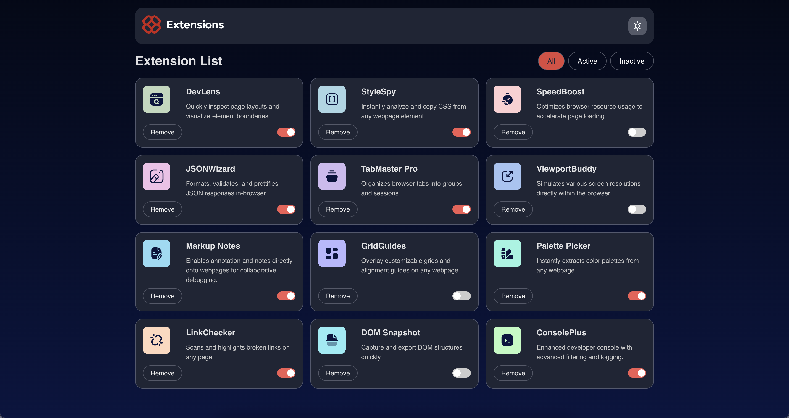
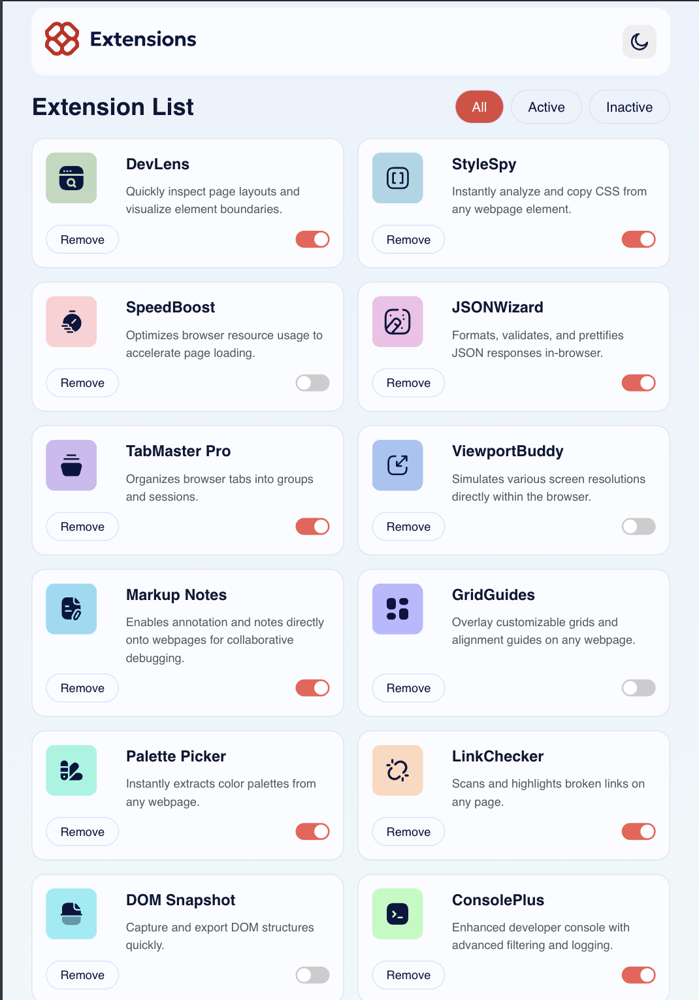
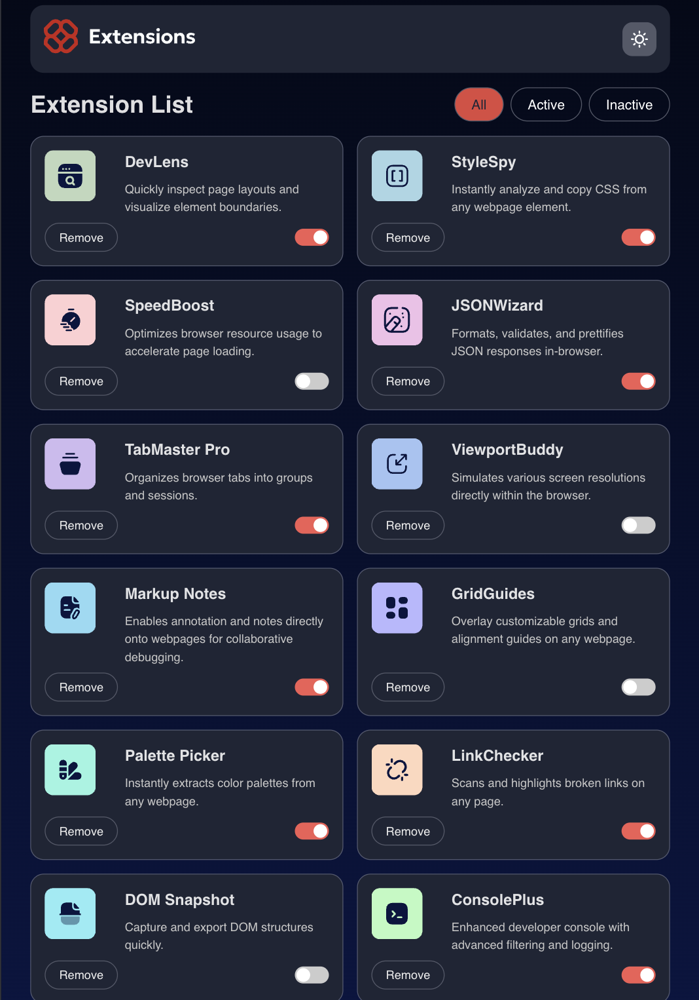
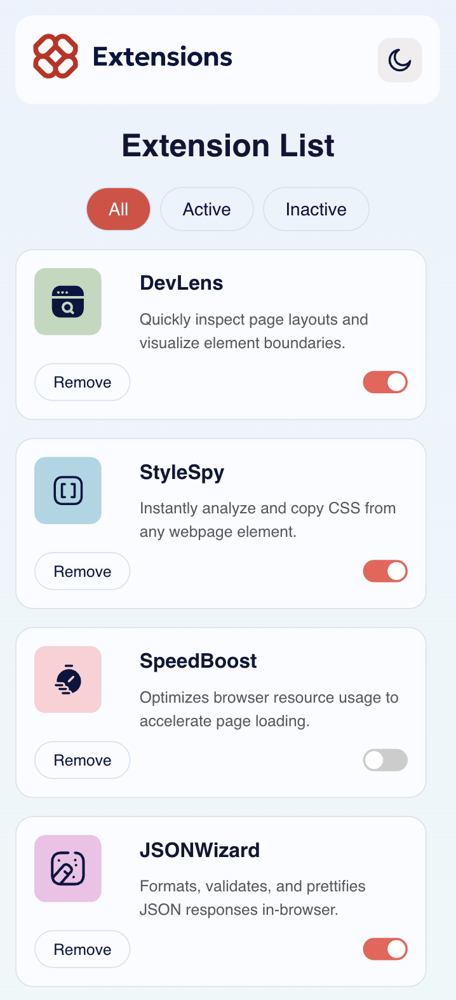
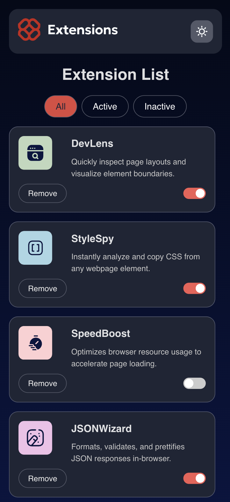

# Frontend Mentor - Browser extensions manager UI solution

This is a solution to the [Browser extensions manager UI challenge on Frontend Mentor](https://www.frontendmentor.io/challenges/browser-extension-manager-ui-yNZnOfsMAp). Frontend Mentor challenges help you improve your coding skills by building realistic projects.

## Table of contents

- [Overview](#overview)
  - [The challenge](#the-challenge)
  - [Screenshot](#screenshot)
  - [Links](#links)
- [My process](#my-process)
  - [Built with](#built-with)
  - [What I learned](#what-i-learned)
- [Author](#author)

## Overview

### The challenge

Users should be able to:

- Toggle extensions between active and inactive states
- Filter active and inactive extensions
- Remove extensions from the list
- Select their color theme
- View the optimal layout for the interface depending on their device's screen size
- See hover and focus states for all interactive elements on the page

### Screenshots:

- Desktop

  #### Light Mode

  

  #### Dark Mode

  

- Tablet
  #### Light Mode
  
  #### Dark Mode
  
- Mobile
  #### Light Mode
  
  #### Dark Mode
  

### Links

- Solution URL: [Github](https://github.com/phanindra28/browser-extensions-manager-ui-main)
- Live Site URL: [Live](https://phanindra28.github.io/browser-extensions-manager-ui-main/)

## My process

### Built with

- Semantic HTML5 markup
- CSS custom properties
- Flexbox
- CSS Grid
- Mobile-first workflow
- Create React App
- [React](https://reactjs.org/) - JS library

### What I learned

I had a great opportunity to practice my React skills with this project. I learned to dynamically render the svg images. Also, I learned how to manage state effectively, especially when dealing with toggling active and inactive states for extensions. I also improved my CSS skills, particularly in creating responsive designs that adapt well to different screen sizes.

## Author

- Github - [phanindra28](https://github.com/phanindra28)
- Frontend Mentor - [phanindra28](https://www.frontendmentor.io/profile/phanindra28)
